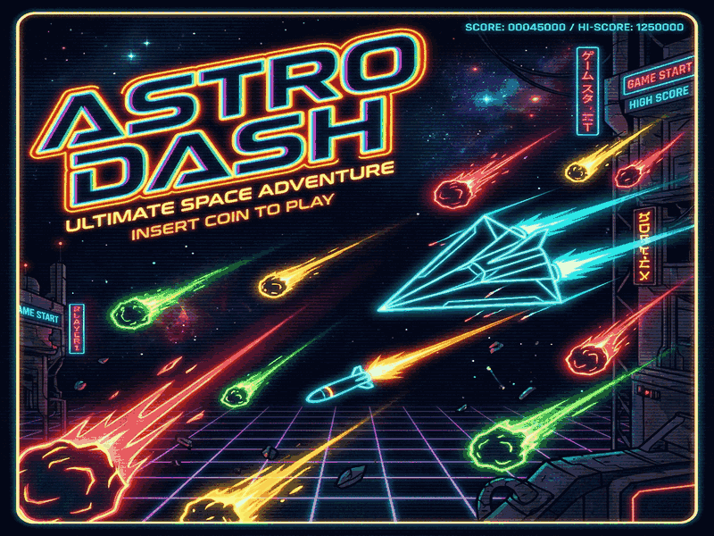

# 🚀 ASTRO DASH



**High-speed space survival and combat.** 
Outlast the meteor storms solo or duel a rival pilot in the gritty Core Sector. Built for the [Platanus Hack 26 Arcade Challenge](https://hack.platan.us/26-ar).

## 🌌 The Game

In the year 2142, the Core Sector is a graveyard of industrial debris and volatile meteor storms. As a Scavenger Pilot, your goal is simple: **Survive.**

**Astro Dash** is a fast-paced arcade shooter featuring:
- **Solo Survival Mode**: Face increasingly intense waves of meteors and the dreaded Sector Bosses.
- **1v1 Duel Mode**: Battle a rival pilot in a test of reflexes and tactical maneuvering.
- **Color-Sync Combat**: Align your weapon frequency with hazards to pierce through dense meteor clusters.
- **Scavenger OS UI**: A high-fidelity, industrial-themed interface designed for maximum tactical awareness.
- **Procedural Powerups**: Hack the sector for Missiles, Shields, Flares, and Energy Overdrive.

## 🕹️ Controls

Designed for authentic arcade hardware. Never settle for default inputs.

| Input | Action | P1 Key | P2 Key |
| :--- | :--- | :--- | :--- |
| **Joystick** | Movement | `W/A/S/D` | `Arrows` |
| **BTN 1, 2, 3** | Primary Fire | `U, I, O` | `R, T, Y` |
| **BTN 4, 5** | Lateral Dodge | `J, K` | `F, G` |
| **BTN 6** | Special Weapon | `L` | `H` |
| **START** | Begin Mission | `Enter` | `2` |

## 🛠️ Technical Specs

Built within the extreme constraints of the Core Sector:
- **Engine**: Phaser 3 (v3.87.0)
- **Footprint**: < 50KB Minified (Currently ~43KB)
- **Rendering**: Procedural vector graphics and custom canvas effects.
- **Persistence**: High-score tracking via `platanusArcadeStorage`.

## 🚀 Development

### Installation
```bash
bun install
```

### Run Locally
```bash
bun dev
```
*The dev server includes live restriction checking to ensure the game stays within the 50KB limit and adheres to sandbox rules.*

### Validation
Ensure your build is flight-ready:
```bash
npm run check-restrictions
```

---

*Astro Dash is a submission for the Platanus Hack 26. Created with grit, neon, and high-frequency code.*
